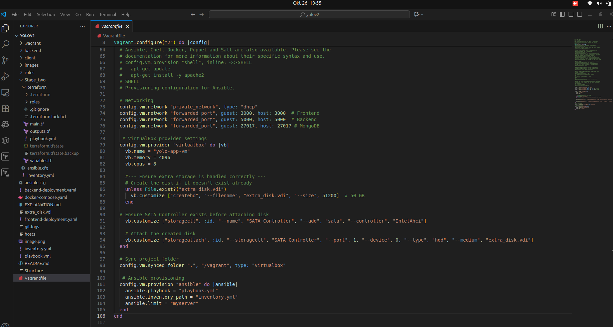

# YOLO E-commerce Application Deployment Explanation

This document details the setup and execution of the YOLO e-commerce application for Stage 1 (Vagrant) and Stage 2 (AWS).

## Stage 1: Vagrant Deployment

### Vagrantfile Creation
1. Initialized with:
```bash
    vagrant init geerlingguy/ubuntu2004
```

2. Configured `Vagrantfile` to:

- Use `geerlingguy/ubuntu2004` box.
- Allocate 8 CPUs and 4GB RAM.
- Forward ports 3000, 5000, and 27017.
- Sync project directory to `/vagrant`.
- Run `playbook.yml` via Ansible provisioner (`vagrant provision`).




### Ansible Roles Creation
Roles were created using:
```bash
ansible-galaxy init roles/<rolename>
```
This generated `tasks/` and `vars/` directories. Variables are in `roles/<rolename>/vars/main.yml`.


### Playbook and Role Execution
The `playbook.yml` invokes roles sequentially via ```vagrant provision```. Ansible runs on the host, targeting the VM (```myserver```, 127.0.0.1:2222).

**Roles**

1. **install_docker:**

- **Purpose:** Installs Docker (**docker-ce, docker-ce-cli, containerd.io, docker-compose-plugin**) on the VM.
- **Why First:** Docker is required for containers.
- **Variables:** `docker_packages`.
- **Modules:** `apt, apt_key, apt_repository, service`.


2. **db_container:**

- **Purpose:** Runs MongoDB (`mongo:latest`) with `yolomy` database on port 27017.
- **Why Second:** Database needed before backend.
- **Variables:** `db_image, db_name, docker_network, db_port`.
- **Modules:** `docker_network, docker_container`.
- **Tag:** `database`.


3. **backend_container:**

- Purpose: Runs backend (`majangajohn/nyange-yolo-backend:v1.0.0`).
- **Why Third:** Depends on MongoDB.
- **Variables:** `backend_image, backend_port, docker_network, db_name`.
- **Modules:** `docker_image, docker_container`.
- **Tag:** `backend`.


4. **frontend_container:**

- **Purpose:** Runs frontend (`majangajohn/nyange-yolo-client:v1.0.0`, Nginx-based) on port 3000.
- **Why Last:** Depends on backend.
- **Variables:** `frontend_image, frontend_port, docker_network, backend_port`.
- **Modules:** `docker_image, docker_container`.
- **Tag:** `frontend.`

### Execution Details
- **Application Location**: Runs in Docker containers (`app-mongo`, `nyange-yolo-backend`, `nyange-yolo-client`) pulled from Docker Hub.
- **Cloned Repository**: Stored at `/home/vagrant/yolo` for inspection, not used by containers.
- **Access**: `http://localhost:3000`.

### Good Practices

- **Variables:** Per-role variables for modularity.
- **Roles:** Standardized via ansible-galaxy init.
- **Tags:** Enable selective execution.
- **Data Persistence:** MongoDB volume (`app-mongo-data`).
- **Network:** `yolo-net` (subnet 172.20.0.0/16).

## Stage 2: AWS Deployment
**Terraform Setup**
Terraform provisions an EC2 instance (`t3.micro`) and triggers Ansible.

1. **main.tf:**

- Uses AWS provider, reading credentials from `AWS_ACCESS_KEY_ID` and `AWS_SECRET_ACCESS_KEY`.
- Creates security group for ports 3000, 5000, 27017, and 22.
- Launches `t3.micro` instance with Ubuntu 20.04 AMI.
- Runs Ansible via `local-exec`.


2. **variables.tf:**

- Defines `aws_region, ami_id, key_name, key_path`.


3. **outputs.tf:**

Outputs EC2 public IP.


#### AWS Credentials
**Obtain AWS Credentials:**
Log in to the AWS Management Console.
Navigate to **IAM > Users > [Your User] > Security credentials**.
Create an access key under Access keys and download the CSV containing ```Access Key ID``` and ```Secret Access Key```.


**Set Environment Variables:**
- On your host machine (Linux/Mac), set the environment variables:
and make them persistent, add to ```~/.bashrc ``` or ```~/.zshrc```:

```bash
echo "export AWS_ACCESS_KEY_ID=your-access-key-id" >> ~/.bashrc
echo "export AWS_SECRET_ACCESS_KEY=your-secret-access-key" >> ~/.bashrc
source ~/.bashrc
```
- Verify:
```bash
echo $AWS_ACCESS_KEY_ID
echo $AWS_SECRET_ACCESS_KEY
```

**Configure Terraform to Use Environment Variables:**
Terraform automatically reads ```AWS_ACCESS_KEY_ID ```and ```AWS_SECRET_ACCESS_KEY``` for the AWS provider, so no explicit variables are needed for credentials in ```variables.tf```.

```bash
export TF_VAR_aws_access_key=$AWS_ACCESS_KEY_ID
export TF_VAR_aws_secret_key=$AWS_SECRET_ACCESS_KEY
export TF_VAR_aws_region=$AWS_DEFAULT_REGION

```

## EC2 Key Pair

- Created in AWS Console (`EC2 > Key Pairs > Create key pair`):

    - Name: `yolo-key`, Type: RSA, Format: `.pem`.
    - Stored as `~/.ssh/yolo-key.pem` with `chmod 400.`


- Used in Terraform: `key_name = "yolo-key", key_path = "~/.ssh/yolo-key.pem".`

## AMI ID Selection

- Chose `ami-0e86e20dae9224db8` (Ubuntu 20.04 LTS, `us-east-1`).
- Find AMI ID for your region:

```bash
aws ec2 describe-images --owners 099720109477 --filters "Name=name,Values=*ubuntu-focal-20.04-amd64-server*" --query "Images[*].[ImageId,Name]" --output table
```

- Update `variables.tf` with the correct AMI ID.

## Execution

1. Initialize Terraform:
```bash
cd Stage_two/terraform
terraform init
```

2. Plan and apply:
```bash
terraform plan 
terraform apply 
```
3. Access at `http://<public_ip>:3000`.


## verify
```bash
ssh -i ~/.ssh/yolo-key.pem ubuntu@<public_ip> "docker ps"
ssh -i ~/.ssh/yolo-key.pem ubuntu@<public_ip> "ls /home/ubuntu/yolo"
```
## Good Practices

- **Credentials:** Stored in environment variables for security.
- **Variables:** Used in Terraform for flexibility.


## Notes

- **Environment Variables:** AWS credentials are securely handled via `AWS_ACCESS_KEY_ID` and `AWS_SECRET_ACCESS_KEY`.
- **EC2 Key Pair:** `yolo-key` is created in AWS and used in Terraform; key_path points to the local `.pem` file.
- **AMI ID:** `ami-0e86e20dae9224db8` is for `us-east-1`; update `variables.tf` for your region using AWS Console or CLI.
- **Cloned Repository**: Stored at `/home/ubuntu/yolo` for inspection, not used by containers.

