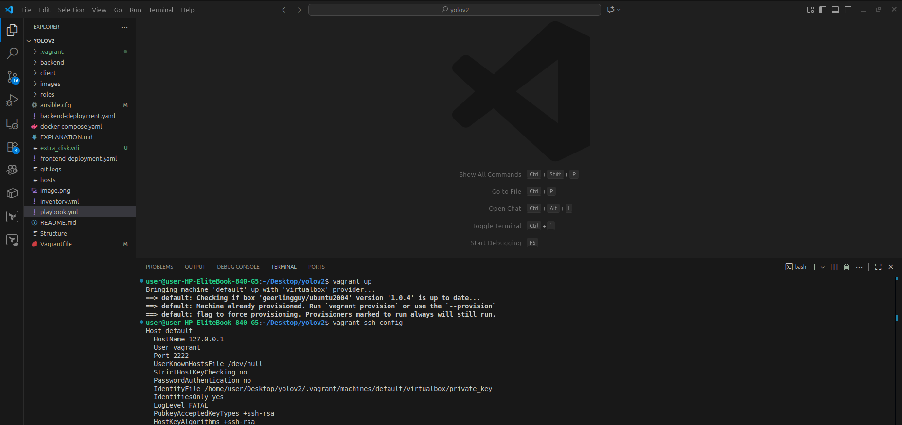
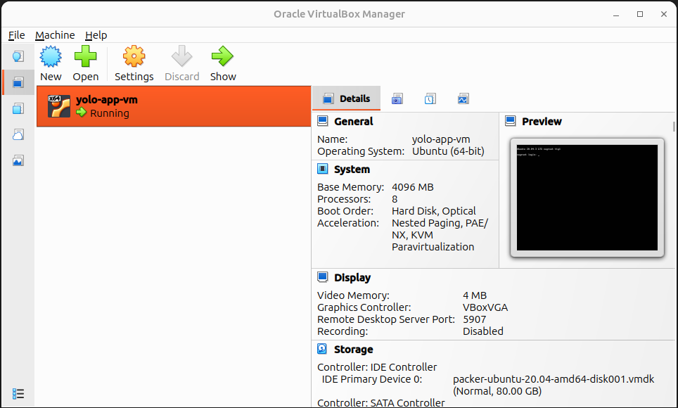
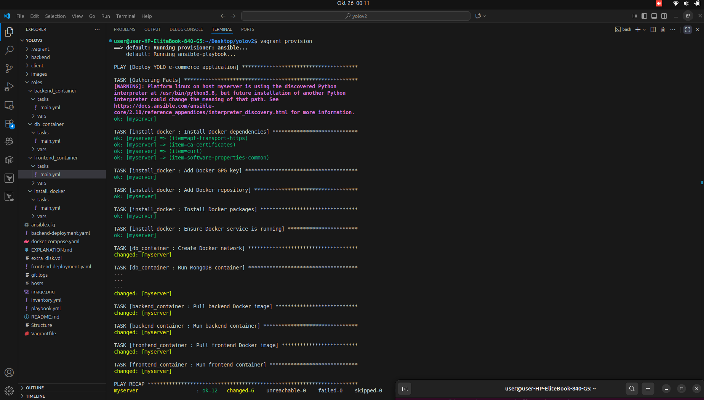
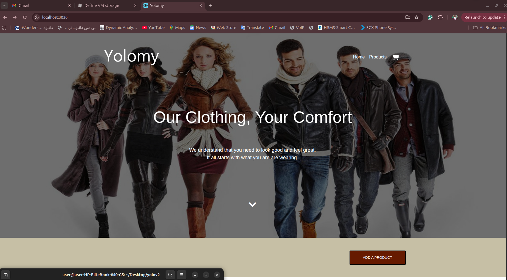
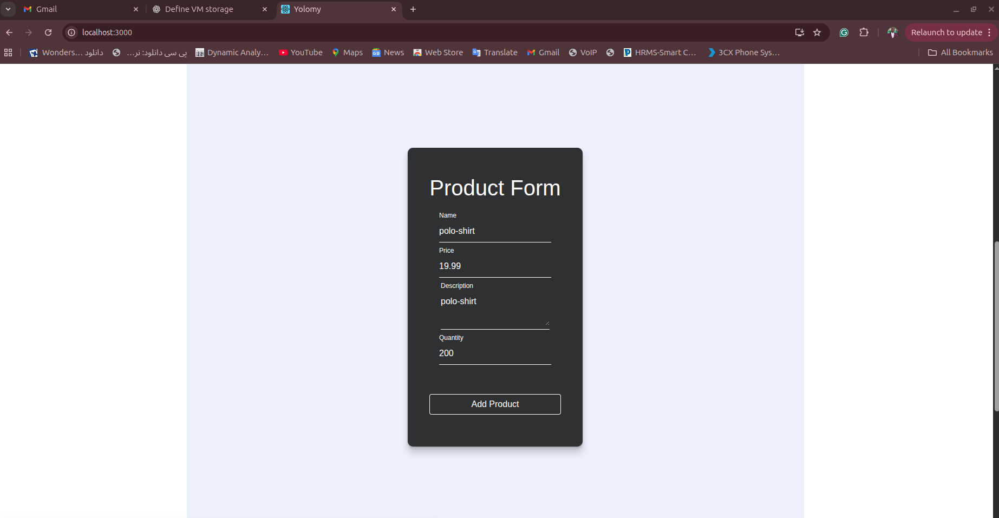

# YOLO E-commerce Application Deployment

This repository automates the deployment of the YOLO e-commerce application using Vagrant (Stage 1) and AWS with Terraform (Stage 2). The application runs in Docker containers (frontend: Nginx, backend: Node.js, database: MongoDB) and is accessible on port 3000.

## Prerequisites
- Git
- Oracle VirtualBox (Stage 1)
- Vagrant (Stage 1)
- Ansible (host machine)
- Terraform (Stage 2)
- AWS account with access key, secret key, and SSH key pair (Stage 2)

## Stage 1: Vagrant Deployment

### Step-by-Step Guide
#### Step 1: Install Prerequisites on the Host Machine**
**Install Git:**
```bash
    sudo apt update
    sudo apt install -y git
    git --version      
```

**Install Oracle VirtualBox:**
```bash
sudo apt update
sudo apt install -y software-properties-common
sudo add-apt-repository "deb [arch=amd64] https://download.virtualbox.org/virtualbox/debian $(lsb_release -cs) contrib"
wget -q https://www.virtualbox.org/download/oracle_vbox_2016.asc -O- | sudo apt-key add -
sudo apt update
sudo apt install -y virtualbox-7.0
vboxmanage --version
```
**Install Vagrant:**
```bash
wget https://releases.hashicorp.com/vagrant/2.4.1/vagrant_2.4.1_linux_amd64.deb
sudo dpkg -i vagrant_2.4.1_linux_amd64.deb
vagrant --version
```

**Install Ansible (on Host Only):**
```bash
sudo apt install -y python3 python3-pip
sudo pip3 install ansible
ansible --version
```

**Install Terraform (for Stage 2):**
```bash
wget https://releases.hashicorp.com/terraform/1.9.7/terraform_1.9.7_linux_amd64.zip
unzip terraform_1.9.7_linux_amd64.zip
sudo mv terraform /usr/local/bin/
terraform --version
```

#### Step 2: Set Up the Project
**Clone the repository::**

```bash
git clone https://github.com/Majangajohn/yolov2.git
cd yolov2
```

## 📁 Project Structure
├── ansible.cfg
├── backend
│   ├── Dockerfile
│   ├── models
│   │   └── Products.js
│   ├── package.json
│   ├── routes
│   │   └── api
│   ├── server.js
│   └── upload.js
├── backend-deployment.yaml
├── client
│   ├── Dockerfile
│   ├── nginx.conf
│   ├── package.json
│   ├── public
│   │   ├── favicon.ico
│   │   ├── index.html
│   │   ├── logo192.png
│   │   ├── logo512.png
│   │   ├── manifest.json
│   │   └── robots.txt
│   ├── README.md
│   └── src
│       ├── App.css
│       ├── App.test.js
│       ├── components
│       ├── images
│       ├── index.js
│       ├── product-detail.css
│       ├── serviceWorker.js
│       └── setupTests.js
├── docker-compose.yaml
├── EXPLANATION.md
├── extra_disk.vdi
├── frontend-deployment.yaml
├── git.logs
├── hosts
├── image.png
├── images
│   ├── ansible-roles.png
│   ├── hosted-app.png
│   ├── products-catalog.png
│   ├── terraform.png
│   ├── vagrant-ansible-adding-product.png
│   ├── vagrant-ansible-landing-page.png
│   ├── vagrant-provision.png
│   ├── vagrant-up.png
│   └── vagrant-up-vm-gui.png
├── inventory.yml
├── playbook.yml
├── README.md
├── roles
│   ├── backend_container
│   │   ├── tasks
│   │   └── vars
│   ├── db_container
│   │   ├── tasks
│   │   └── vars
│   ├── frontend_container
│   │   ├── tasks
│   │   └── vars
│   └── install_docker
│       ├── tasks
│       └── vars
├── Stage_two
│   ├── ansible.cfg
│   ├── inventory.yml
│   └── terraform
│       ├── main.tf
│       ├── outputs.tf
│       ├── playbook.yml
│       ├── roles
│       └── variables.tf
├── Structure
└── Vagrantfile


#### Step 3: Provision the VM:
- After cloning, go to the root of the project and running the following command to provision vm

```bash
vagrant up
```




```bash
vagrant provision
```




#### Step 4: Access the Application:
- **Host Machine:** Open ```http://localhost:3000 ```in a browser.

- **VM:** SSH into the VM (```vagrant ssh```) and run curl ```http://localhost:3000```.

- Test the "Add Product" functionality to verify data persistence.






#### Alternative access link to hosted platform on AWS:
```http://<public_ip>:3000```


#### Project Structure

- `Vagrantfile:` Provisions Ubuntu VM with 8 CPUs and 4GB RAM.
- `playbook.yml:` Ansible playbook defining roles.
- `roles/:` Contains roles with tasks and variables.
- `images/:` Placeholder screenshot.
- `backend/`, `client/:` Application code directories.
- `Stage_two/:` Terraform and Ansible files for AWS.
- `explanation.md:` Setup and execution details.

#### Troubleshooting

Ensure ports 3000, 5000, and 27017 are open.
Check MongoDB volume (app-mongo-data) for persistence.
